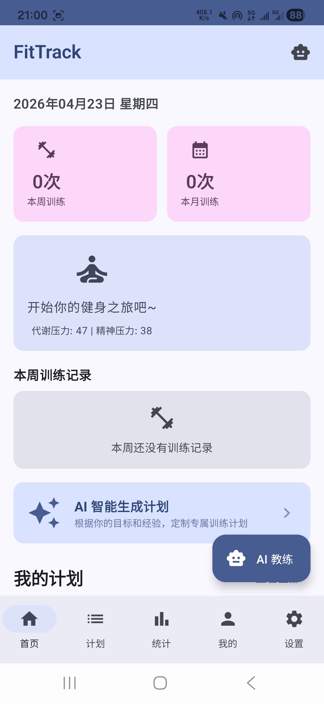
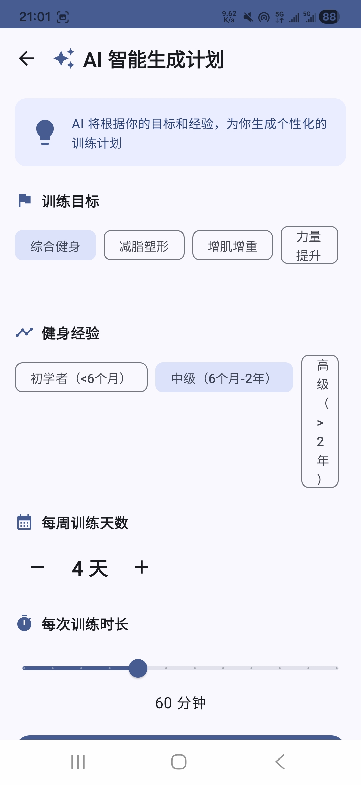
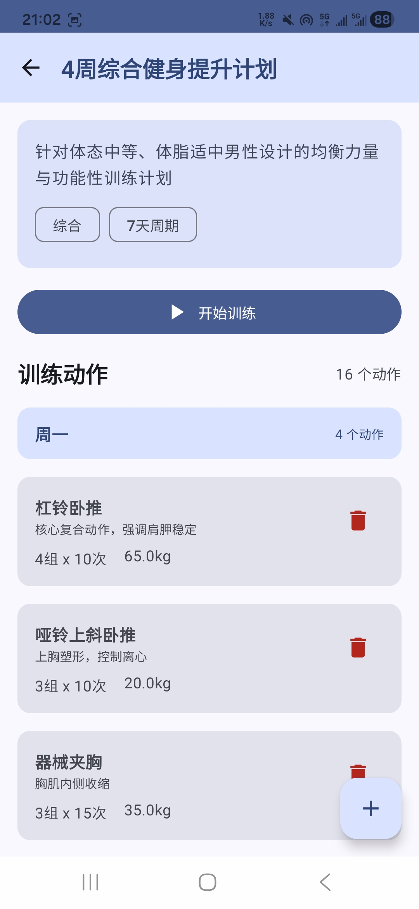
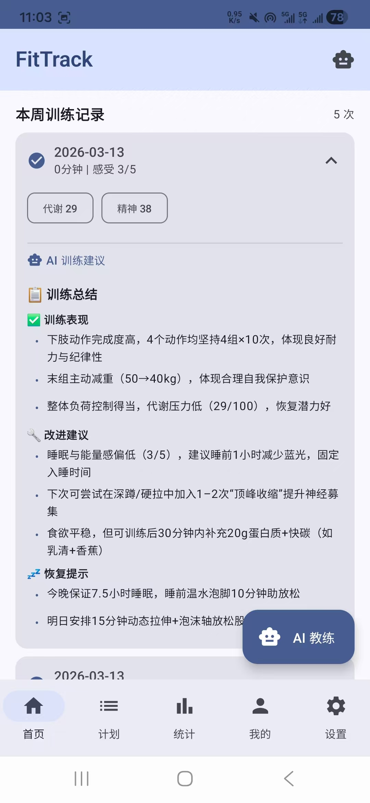
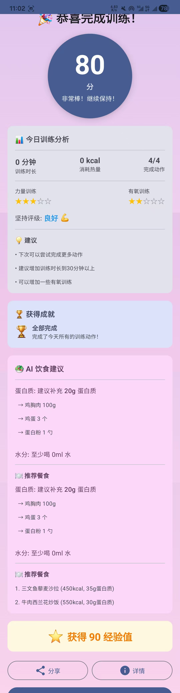
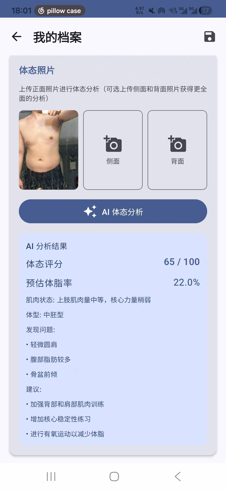
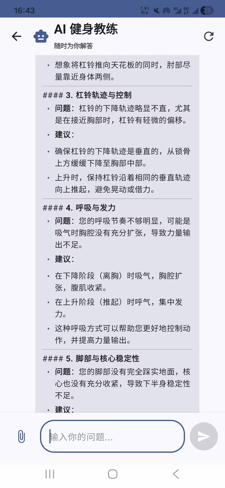

# FitTrack 项目文档

> 基于 Android Jetpack Compose 的 AI 智能健身教练应用
> 技术栈：Kotlin · Compose · Room · Qwen 多模态 API · WorkManager · Glance Widget

---

## 目录

- [项目概览](#项目概览)
- [功能截图](#功能截图)
- [架构总览](#架构总览)
- [代码结构](#代码结构)
- [数据层详解](#数据层详解)
- [AI 多模态系统](#ai-多模态系统)
- [Multi-Agent 协作机制](#multi-agent-协作机制)
- [UI 层详解](#ui-层详解)
- [桌面小部件](#桌面小部件)
- [定时任务与提醒](#定时任务与提醒)
- [导航系统](#导航系统)
- [待完成事项](#待完成事项)

---

## 项目概览

FitTrack 是一个 Android 健身追踪应用，核心卖点是**AI 动作分析**——用户拍照或录视频，AI 分析动作是否标准并给出建议。此外还有训练计划管理、饮食建议、压力分析等功能。

### 核心功能

| 功能 | 描述 |
|------|------|
| AI 动作分析 | 拍照/录视频 → Qwen 多模态 API → 动作评估和建议 |
| 训练计划管理 | 创建、编辑、执行训练计划，按周安排日程 |
| 训练记录 | 记录每组动作的重量、次数、时长 |
| 饮食建议 | AI 根据用户目标生成营养建议 |
| 压力分析 | 基于训练数据评估身体恢复状态 |
| 桌面小部件 | Glance Widget 显示今日训练计划 |
| 定时提醒 | WorkManager 定时提醒训练 |

---

## 功能截图

<table>
  <tr>
    <td align="center"><b>首页 - 训练概览</b></td>
    <td align="center"><b>AI 生成训练计划</b></td>
    <td align="center"><b>生成计划详情</b></td>
  </tr>
  <tr>
    <td></td>
    <td></td>
    <td></td>
  </tr>
  <tr>
    <td align="center">今日训练概览、快捷操作、最近记录</td>
    <td align="center">选择目标后 AI 自动生成结构化计划</td>
    <td align="center">计划包含动作、组数、次数、重量</td>
  </tr>
</table>

<table>
  <tr>
    <td align="center"><b>训练记录（AI 总结）</b></td>
    <td align="center"><b>训练完成 AI 总结</b></td>
    <td align="center"><b>用户体态分析</b></td>
  </tr>
  <tr>
    <td></td>
    <td></td>
    <td></td>
  </tr>
  <tr>
    <td align="center">AI 总结训练内容并更新用户画像</td>
    <td align="center">训练后 AI 生成总结，保存到训练记录</td>
    <td align="center">拍照分析体态，构建用户画像用于个性化建议</td>
  </tr>
</table>

<table>
  <tr>
    <td align="center"><b>AI 教练对话</b></td>
  </tr>
  <tr>
    <td></td>
  </tr>
  <tr>
    <td align="center">上传视频/图片咨询动作安全风险、正确做法等</td>
  </tr>
</table>

---

## 架构总览

采用标准 MVVM 架构：

```
UI Layer (Compose Screens)
    ↕ StateFlow
ViewModel Layer (FitTrackViewModel, ChatViewModel, ...)
    ↕ Repository Pattern
Data Layer (Room DB + Qwen API)
    ↕
External (Qwen Cloud API)
```

### 关键依赖

```
Jetpack Compose (BOM 2024.06.00, Material3)
Room (KSP, 数据持久化)
Retrofit + Gson (网络请求)
WorkManager (定时任务)
Glance (桌面小部件)
DataStore / EncryptedSharedPreferences (设置存储)
```

### 构建配置

- `compileSdk = 34`, `minSdk = 24`, `targetSdk = 34`
- Kotlin 17, Compose Compiler 1.5.14
- KSP 替代 kapt

---

## 代码结构

```
com.fittrack/
├── FitTrackApplication.kt       # Application，全局崩溃处理 + 通知渠道 + Widget 初始化
├── MainActivity.kt              # 单 Activity，Compose 入口
│
├── ai/
│   └── tools/
│       └── MultimodalAnalysisTool.kt  # 图片/视频分析封装
│
├── data/
│   ├── api/
│   │   ├── QwenApiService.kt         # Retrofit 接口定义
│   │   ├── QwenRepository.kt         # Qwen API 核心仓库（最大文件，700+ 行）
│   │   ├── QwenRequest.kt            # 请求体模型
│   │   ├── QwenResponse.kt           # 响应体模型
│   │   └── NutritionAdvisor.kt       # 饮食建议（调用 Qwen）
│   ├── analyzer/
│   │   └── PressureAnalyzer.kt       # 训练压力分析器
│   ├── db/
│   │   ├── FitTrackDatabase.kt       # Room 数据库定义
│   │   ├── WorkoutPlanDao.kt         # 训练计划 DAO
│   │   ├── ExerciseDao.kt            # 练习动作 DAO
│   │   ├── WorkoutRecordDao.kt       # 训练记录 DAO
│   │   ├── ExerciseRecordDao.kt      # 练习记录 DAO
│   │   ├── WorkoutScheduleDao.kt     # 日程 DAO
│   │   ├── UserProfileDao.kt         # 用户档案 DAO
│   │   ├── ChatDao.kt                # 聊天记录 DAO
│   │   ├── MealRecordDao.kt          # 饮食记录 DAO
│   │   └── NutritionAdviceDao.kt     # 营养建议 DAO
│   ├── entity/
│   │   ├── WorkoutPlan.kt            # 训练计划实体 + Exercise + WorkoutRecord + ExerciseRecord
│   │   ├── WorkoutSchedule.kt        # 周日程实体
│   │   ├── UserProfile.kt            # 用户档案实体
│   │   ├── ChatMessage.kt            # 聊天消息实体
│   │   └── MealRecord.kt             # 饮食记录实体
│   ├── repository/
│   │   ├── FitTrackRepository.kt     # 主仓库（聚合所有 DAO）
│   │   ├── UserProfileRepository.kt  # 用户档案仓库
│   │   ├── MealRepository.kt         # 饮食仓库
│   │   └── FunPhrasesRepository.kt   # 趣味提示语
│   ├── scheduler/
│   │   └── WorkoutScheduler.kt       # 训练日程调度器
│   └── storage/
│       └── SettingsManager.kt        # 设置管理（EncryptedSharedPreferences）
│
├── reminder/
│   └── WorkoutReminderWorker.kt      # WorkManager 训练提醒
│
├── ui/
│   ├── components/
│   │   └── MarkdownText.kt           # Markdown 渲染组件
│   ├── navigation/
│   │   ├── Screen.kt                 # 路由定义
│   │   ├── FitTrackNavHost.kt        # NavHost + 底部导航
│   │   └── Transition.kt             # 多邻国风格过渡动画
│   ├── screens/
│   │   ├── HomeScreen.kt             # 首页（训练概览 + 底部导航）
│   │   ├── ChatScreen.kt             # AI 聊天（图片/视频分析）
│   │   ├── PlanListScreen.kt         # 训练计划列表
│   │   ├── PlanDetailScreen.kt       # 计划详情 + 执行训练
│   │   ├── AddPlanScreen.kt          # 新建/编辑计划
│   │   ├── PlanGeneratorScreen.kt    # AI 生成训练计划
│   │   ├── WorkoutScreen.kt          # 训练执行界面
│   │   ├── StatisticsScreen.kt       # 统计（⚠️ 部分假数据）
│   │   ├── ProfileScreen.kt          # 用户档案
│   │   ├── OnboardingScreen.kt       # 首次使用引导
│   │   └── SettingsScreen.kt         # 设置页
│   ├── theme/
│   │   ├── Theme.kt                  # Material3 主题
│   │   └── Type.kt                   # 字体排版
│   └── viewmodel/
│       ├── FitTrackViewModel.kt      # 主 ViewModel
│       ├── ChatViewModel.kt          # 聊天 ViewModel（图片/视频处理）
│       ├── PlanGeneratorViewModel.kt # AI 生成计划
│       ├── ProfileViewModel.kt       # 用户档案
│       ├── SettingsViewModel.kt      # 设置
│       └── MealViewModel.kt          # 饮食
│
└── widget/
    ├── FitTrackWidget.kt             # Glance 桌面小部件 UI
    ├── WidgetDataProvider.kt         # Widget 数据提供者
    ├── WidgetUpdateWorker.kt         # Widget 定时刷新 Worker
    └── WidgetConfigActivity.kt       # Widget 配置 Activity
```

---

## 数据层详解

### Room 数据库

`FitTrackDatabase` 是唯一的 Room 数据库，包含以下实体：

| 实体 | 表名 | 核心字段 |
|------|------|----------|
| `WorkoutPlan` | workout_plans | id, name, description, goal, difficulty |
| `Exercise` | exercises | id, planId(FK), name, sets, reps, weight, category |
| `WorkoutRecord` | workout_records | id, planId(FK), date, duration, notes |
| `ExerciseRecord` | exercise_records | id, workoutId(FK), exerciseId, actualSets, actualReps, actualWeight |
| `WorkoutSchedule` | workout_schedules | id, planId(FK), dayOfWeek(1-7) |
| `UserProfile` | user_profiles | id(单例), name, age, weight, height, fitnessLevel, goals |
| `ChatMessage` | chat_messages | id, role(user/assistant), content, timestamp, imageBase64 |
| `MealRecord` | meal_records | id, date, mealType, foods, calories, protein, carbs, fat |
| `NutritionAdvice` | nutrition_advice | id, date, advice, caloriesTarget, proteinTarget |

### FitTrackRepository

核心仓库，聚合所有 DAO 操作。采用单例模式（通过 `FitTrackDatabase` 的 DAO 注入）。主要方法：

- 计划 CRUD：`insertPlan()`, `updatePlan()`, `deletePlan()`, `getAllPlans()`
- 记录管理：`insertRecord()`, `getRecordsByPlan()`, `getRecordsByDateRange()`
- 日程管理：`getScheduleForDay()`, `insertSchedule()`, `getTodayExercises()`
- 用户档案：`getUserProfile()`, `saveUserProfile()`

---

## AI 多模态系统

### 系统架构

```
用户拍照/录视频
    ↓
ChatViewModel（图片压缩/视频抽帧 → Base64）
    ↓
MultimodalAnalysisTool（构建提示词）
    ↓
QwenRepository（Retrofit → Qwen API）
    ↓
QwenApiService（HTTP 请求）
    ↓
返回分析结果 → ChatScreen 显示
```

### QwenRepository（核心，700+ 行）

这是最复杂的文件，负责所有与 Qwen（通义千问）大模型的交互：

**能力：**
- 文本对话（`chat()`）
- 图片分析（`chatWithImage()`）— 发送 Base64 图片 + 提示词
- 视频分析（`chatWithImages()`）— 发送多帧 Base64 图片
- 训练计划生成（`generateWorkoutPlan()`）— AI 按用户目标生成结构化 JSON 计划
- 饮食建议（`generateNutritionAdvice()`）
- 动作分析（`analyzeExerciseForm()`）— 分析图片中的动作姿态

**API 配置：**
- 动态 API Key 管理（`SettingsManager` 加密存储）
- 支持 Base URL 配置（可切换不同服务端点）
- `QwenApiService` 使用 Retrofit + Gson

**图片处理：**
- `encodeImageToBase64()` — 压缩大图，`inSampleSize` 逐步降采样
- `imageUriToBase64()` — Content URI → Bitmap → Base64

**响应解析：**
- `extractJson()` — 从 AI 响应中提取 JSON（AI 可能返回带 markdown 包裹的 JSON）
- 支持多种格式的容错解析

### MultimodalAnalysisTool

封装了图片和视频分析的提示词构建：

- **图片分析**：`analyzeImage()` — 构建健身动作分析提示词
- **视频分析**：`analyzeVideo()` — 构建多帧分析提示词，告诉 AI 这是视频帧序列

提示词模板示例：
```
用户上传了一段健身动作的视频，共包含 X 帧。
请分析以下方面：
1. 动作是否标准
2. 主要肌群是否正确激活
3. 改进建议
```

---

## Multi-Agent 协作机制

### 背景

FitTrack 项目使用 **cat-cafe-ts** 作为 Multi-Agent 编排系统。每个 Agent 是一个独立的 Claude CLI 进程，有角色分工：

| Agent | 角色 | 职责范围 |
|-------|------|----------|
| 社珠子 (tamako) | 店长/PM | 需求分析，任务分发，不写代码 |
| 佐佐木 (sasaki) | 前厅经理 | 前端 UI（Compose 界面、动画、导航） |
| 文藏 (bunzo) | 底汤主厨 | 后端数据层（Room DB、API、Repository） |
| 小花 (kohana) | 品控 | 代码审查、编译验证、测试 |

### 协作流程

```
用户 → "帮我实现训练统计页面"
    ↓
社珠子（自动路由）：分析需求，分发任务
    ↓ "@佐佐木 请实现训练统计页面的 UI，@文藏 请确保统计查询接口就绪"
    ↓
    ├── 佐佐木：实现 StatisticsScreen.kt
    │       ↓ 完成后 @社珠子 汇报
    │
    └── 文藏：检查/新增 DAO 查询方法
            ↓ 完成后 @社珠子 汇报
    ↓
社珠子：收到汇报 → @小花 请 code review
    ↓
小花：编译检查 + 代码审查 → @社珠子 汇报审查结果
```

### 关键机制

**1. @mention 路由**
- 用户可以直接 `@佐佐木 修复导航动画` 指定 agent
- 默认发给社珠子（PM），她负责分发
- Agent 回复中也可以 `@其他agent` 触发 A2A 调用链

**2. A2A（Agent-to-Agent）通信**
- Agent 完成后可以 @其他 agent 继续工作
- Per-pair 深度限制：同一对 agent 来回不超过 15 次，新 agent 加入时重置
- 最大每条回复触发 2 个 A2A 调用

**3. 任务队列**
- 每个 agent 有独立的任务队列（串行执行）
- 顶层多 agent 并行（社珠子 @文藏 @佐佐木 → 两人同时开始）
- UI 面板实时显示每个 agent 的当前任务和待处理队列

**4. PlanMode 约束**
- 社珠子使用 `--tools ""` 禁用所有工具，只能输出纯文字委派语句
- 其他 agent 有完全工具权限（`--dangerously-skip-permissions`）

**5. Session 管理**
- 每个 (agent, thread) 维护独立的 CLI session
- 上下文压缩：token 使用达阈值时自动压缩（Micro-Compact → Auto-Compact）
- Session 持久化：重启后通过 `--resume` 恢复

### 在 FitTrack 中的实际应用

FitTrack 的所有代码都是通过这个 Multi-Agent 系统开发的：

1. **BACKLOG.md** 记录了 agent 们发现和修复的 bug
2. **P1 批次**：6 个问题，由文藏（后端）、佐佐木（前端）、小花（品控）协作完成
3. **多邻国风格过渡动画**：佐佐木实现了 `Transition.kt` 的弹性动画系统
4. **图片压缩修复**：文藏修复了大图 OOM 问题（P1-2）
5. **品控流程**：小花发现并记录了 `NavigationBarItem` import 缺失（P1-5/P1-6）

---

## UI 层详解

### 导航结构

底部导航栏四个 Tab：

| Tab | Screen | 功能 |
|-----|--------|------|
| 首页 | HomeScreen | 今日训练概览、快捷操作、最近记录 |
| 计划 | PlanListScreen | 所有训练计划列表 |
| AI教练 | ChatScreen | AI 聊天、拍照分析、视频分析 |
| 我的 | ProfileScreen | 用户档案、统计、设置入口 |

子页面：PlanDetailScreen → WorkoutScreen（训练执行）、AddPlanScreen（编辑计划）、PlanGeneratorScreen（AI 生成计划）、StatisticsScreen、OnboardingScreen、SettingsScreen。

### 过渡动画

`Transition.kt` 实现了**多邻国风格**的弹性动画：
- `ButtonSpring` / `IconSpring`：弹性缩放参数
- `listItemEnter`：列表项错开入场动画
- `STAGGER_DELAY`：错开间隔

### AI 聊天界面（ChatScreen）

核心交互流程：
1. 用户输入文本 → `ChatViewModel.sendMessage()` → Qwen API
2. 用户选择图片 → 压缩为 Base64 → `chatWithImage()` → AI 分析
3. 用户录制视频 → 抽帧为多张 Base64 → `chatWithImages()` → AI 分析

聊天记录通过 Room `ChatMessage` 实体持久化。

### AI 训练计划生成（PlanGeneratorScreen）

用户选择目标（增肌/减脂/耐力等）→ AI 生成结构化的训练计划 JSON → 自动解析并保存到 Room。

---

## 桌面小部件

使用 Glance 框架实现：

```
FitTrackWidget（UI 定义）
    ↕
WidgetDataProvider（读取 Room 数据）
    ↕
WidgetUpdateWorker（WorkManager 定时刷新）
```

显示内容：今日训练计划、已完成/未完成状态。每 30 分钟自动刷新。

`WidgetConfigActivity` 提供配置界面。

---

## 定时任务与提醒

### WorkManager 提醒（WorkoutReminderWorker）

- 根据用户设置的训练日程，定时发送通知
- 通知内容：今日训练计划摘要
- 使用 `ReminderManager.createNotificationChannel()` 创建通知渠道

### 日程调度（WorkoutScheduler）

- 将训练计划绑定到星期几（`WorkoutSchedule`）
- `getTodayExercises()` 获取今天的训练动作
- 与 Widget 和提醒共享数据

---

## 导航系统

```
Screen 对象定义：
├── Home           → HomeScreen
├── PlanList       → PlanListScreen
├── Chat           → ChatScreen
├── Profile        → ProfileScreen
├── PlanDetail(id) → PlanDetailScreen
├── AddPlan(id?)   → AddPlanScreen（新建/编辑）
├── PlanGenerator  → PlanGeneratorScreen
├── Workout(id)    → WorkoutScreen
├── Statistics     → StatisticsScreen
├── Onboarding     → OnboardingScreen
└── Settings       → SettingsScreen
```

`FitTrackNavHost.kt` 定义所有路由和页面切换动画。

---

## 待完成事项

> 详细清单见 BACKLOG.md

### P2（下一迭代）
- **BUG-001**: 通知 ID 碰撞风险（`WorkoutReminderWorker.kt`）
- **BUG-002**: 整数除法精度丢失（`PressureAnalyzer.kt`）
- **BUG-003**: `extractJson` 提取策略脆弱（`QwenRepository.kt`）

### P3（后续迭代）
- `ChatViewModel.imageUriToBase64` 无 OOM 防护
- `StatisticsScreen` 周训练概览使用硬编码假数据
- `WorkoutScheduler.getTodayExercises` 多计划场景只取第一个
- `SettingsManager` 加密降级时无用户提示
- 大量重复的 API 调用错误处理模式需抽取通用方法
